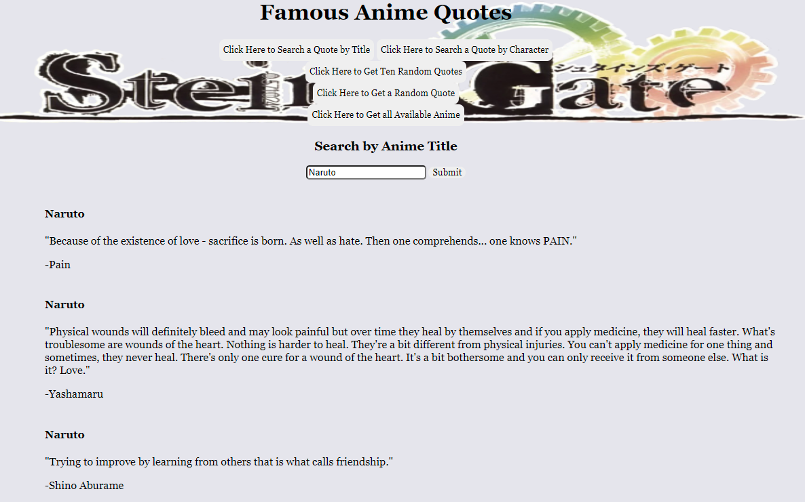
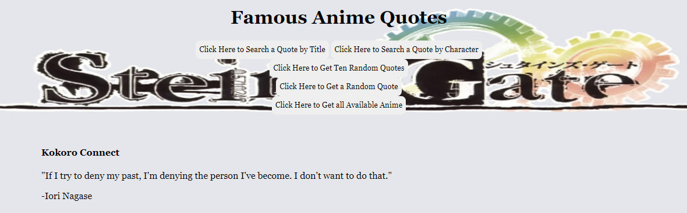
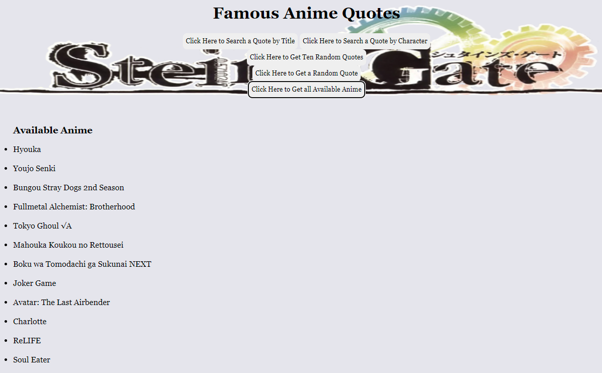

# Anime Quotes Project (Phase 1)

## Goal of the Project

This project will demonstrate my initial knowledge of JavaScript, CSS, and HTML

---

## Functionality

As a user in this Single Page Application, 

- I can get a random quote displayed to the screen

- I can get 10 random quotes displayed on the screen

- I can see all available anime shows from the API

- I can get quotes based on the title of an anime show

- I can get quotes based on the name of the character

---

## Overview

Upon loading the page the home screen looks like this
where there are five buttons to interact with, all labeled

 

Clicking either or both the first two buttons will toggle the forms to show/hide, giving the user the ability to search for quotes based on the name of the anime or a character

 

The below images shows what using the title and character forms respectively

 

The third button will display ten random quotes from the API each time the button is clicked

The fourth button will display a random quote each time the button is clicked (Displaying ten quotes looks similar to this)

 

The last button will display all available anime that is in the database of the API (Not limited to what's displayed in the screenshot)

 

---

## API Used in this Project

[Animechan API](https://animechan.vercel.app/)